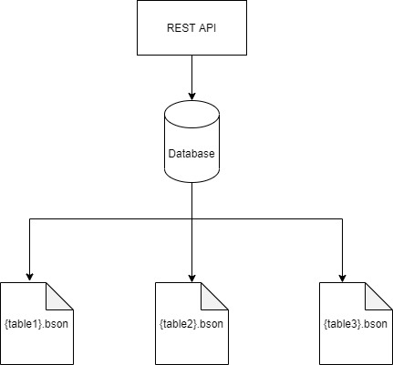

# Wind Database

This is a try at a good File-Based Cloud Database.

Implementation Features include:
1. Python for interacting with the database.
2. Node.js or another framework for the REST API.

With Features such as:
1. Projects
2. Users
3. Collections
4. Rows

The functionalities in v1 are supposed to be:
1. Creation of Collections
2. Addition of Rows.
3. Updation of Rows.
4. Deletion of Rows.
5. Querying of Rows.

Options for the format of storage of data:
1. Plain JSON
2. Binary JSON (Preferrable)
3. Fixed Binary Engine (In case we need a fixed schema model.)

Wind V1 Architecure:
